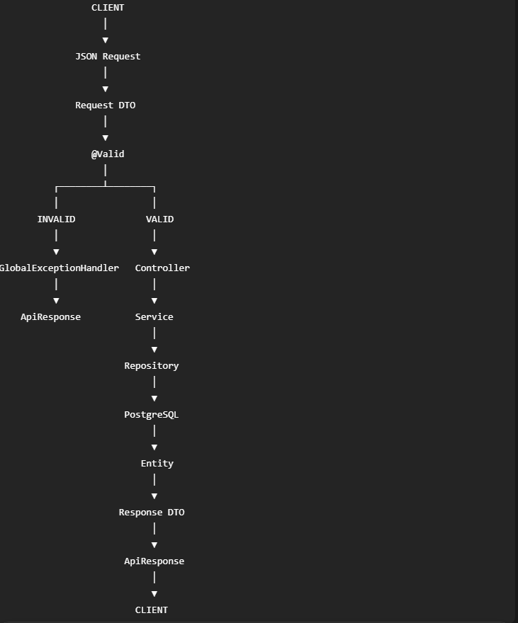

# Daily Journal

**Project:** SKCP (Shree Kundodari Cement Products)  
**Period:** 07 August 2026 – 10 August 2026  
**Focus:** Module 4.5 – Backend Refinement, DTOs, Validation, Exception Handling & Postman Testing  

---

## 07 August 2026  

### Objective  
Begin **Module 4.5 – Backend Refinement** after completing the core Spring Boot backend.  
Focus shifted from basic CRUD implementation toward a more structured, enterprise-style API design.  

---

## Work Completed  

### 1. DTO Architecture  
Introduced separate request and response DTOs for backend APIs.  

**Pattern established:**  

```text
Client
↓
Request DTO
↓
Controller
↓
Service
↓
Entity
↓
Repository
↓
Database
```

For responses:


```text
Database
↓
Entity
↓
Service
↓
Response DTO
↓
ApiResponse
↓
Client
```


### 2. Product DTOs
Product APIs were refined using dedicated DTOs:

- `ProductCreateRequest`
- `ProductUpdateRequest`
- `ProductResponse`
- `ProductSummaryResponse`

This prevents the database entity from being directly exposed through the REST API.

### 3. Supplier DTOs
Supplier APIs were also moved toward the same DTO-based architecture.

The objective was to make Product and Supplier follow the same master-entity design pattern.

# Major Learning

## Entity ≠ API Response
The database entity represents persistence.

The DTO represents the API contract.

Therefore:

```text
Entity
↓
Database representation

DTO
↓
API representation
```

This separation provides better security, maintainability and future flexibility.

---

## 📅 08 August 2026

### Objective

Continue backend refinement with a focus on validation and consistent API behaviour.

---

## Work Completed

### 1. Request Validation
Introduced Jakarta Bean Validation annotations on request DTOs.

Example concept:

```java
@NotBlank
@NotNull
@Positive
@Size
```

Validation is applied to incoming request DTOs.

## 2. @Valid in Controller

Established the standard Controller pattern:

```java
public ResponseEntity<?> createProduct(
    @Valid
    @RequestBody ProductCreateRequest request)
```

The important flow is:

```text
HTTP Request
    ↓
@RequestBody
    ↓
DTO
    ↓
@Valid
    ↓
Validation
    ↓
Controller
    ↓
Service
```

If validation fails, the request does not proceed to the Service layer.

### 3. Global Exception Handling
Established the concept of centralized exception handling.

Instead of every Controller manually handling exceptions:


```text
Controller
↓
Exception
↓
GlobalExceptionHandler
↓
ApiResponse
↓
Client
```

This provides a consistent error response across the entire application.

---

### 4. ApiResponse Standardization
The common response wrapper was established as:

```java
ApiResponse<T>
```
with:

```text
success
message
data
timestamp
```

Example successful response:

```text
{
  "success": true,
  "message": "Product created successfully",
  "data": { ... },
  "timestamp": "2026-08-08T10:30:00"
}
```

```json
{
  "success": true,
  "message": "Product created successfully",
  "data": {
    "productId": 6,
    "productCode": "SB-005"
  },
  "timestamp": "2026-08-08T..."
}
```

### Major Learning

#### Validation Flow

The complete validation flow was understood:

```text
Client
    ↓
JSON Request
    ↓
Request DTO
    ↓
@Valid
    ↓
Bean Validation
    ↓
Validation Failure?
    ↓
YES → GlobalExceptionHandler → 400
    ↓
NO
    ↓
Service
```

This became an important enterprise backend pattern for SKCP.

# 09 August 2026

## Objective
Standardize the **Master Entity API pattern** across SKCP.  
The focus was on making Product and Supplier behave consistently with the other master entities.

---

## Work Completed

### 1. Common Master Entity Pattern
Established the following standard:

```text
Customer
Supplier
Product
Raw Material
Labour
Asset
```

should follow the same general API architecture.

```text
Controller
↓
Service
↓
Repository
↓
Database
```

**with:**

```text
- Request DTO
- Validation
- Service
- Response DTO
- ApiResponse
```

### 2. DELETE Behaviour Discussion

Reviewed the difference between physical deletion and business deactivation.

For master entities, the preferred SKCP pattern became:

```text
DELETE Request
    ↓
Find Entity
    ↓
Change status
    ↓
Save Entity
    ↓
Return 200 OK
    ↓
ApiResponse
```
instead of physically removing the database record.

**Example**:

```json
{
  "success": true,
  "message": "Product deactivated successfully",
  "data": null,
  "timestamp": "2026-08-10T..."
}
```

**Database state:**

```text
ACTIVE
    ↓
INACTIVE
```
This preserves historical data and avoids breaking relationships with transactional tables.


### 3. Master Entity Consistency
The same concept was identified as suitable for:

- Customer
- Supplier
- Product
- Raw Material
- Labour
- Asset

This establishes a common SKCP Master Entity pattern.

### 4. PUT Update Behaviour

Reviewed the PUT request contract.

Important distinction:

> PUT = complete replacement/update of the resource

Therefore, if `status` is required by the update DTO, it must be included in the request body.

**Example:**

```json
{
  "productCode": "SB-005",
  "productName": "Solid Block",
  "size": "6x3x16",
  "length": 16.00,
  "width": 3.00,
  "height": 6.00,
  "unit": "INCH",
  "description": "Standard 3 inch cement solid block",
  "status": "ACTIVE"
}
```

### Major Architectural Decision

The SKCP Master Entity pattern was standardized around:

**POST**

    ↓
    201 CREATED
    ↓
    ApiResponse<T>

**GET**

    ↓
    200 OK
    ↓
    ApiResponse<T>

**PUT**

    ↓
    200 OK
    ↓
    ApiResponse<T>


**DELETE**

    ↓
    200 OK
    ↓
    ApiResponse<Void>
    ↓
    Entity becomes INACTIVE


This provides consistent behaviour across master data.

---

## 10 August 2026

### Objective
Complete Product Postman Testing and validate the refined Product API implementation end-to-end.

---

## Work Completed

### 1. Product Create API Testing

Tested:

> POST /api/products


Successfully created Product:

```json
{
  "productCode": "SB-005",
  "productName": "Solid Block",
  "size": "6x3x16",
  "length": 16.00,
  "width": 3.00,
  "height": 6.00,
  "unit": "INCH",
  "description": "Standard 3 inch cement solid block"
}
```

The server automatically assigned:

- productId
- status = ACTIVE
-  createdAt

Therefore, status does not need to be supplied during Product creation when the entity/default logic already establishes ACTIVE.

---

### 2. Product GET All Testing

Tested:

> GET /api/products

Result:

> 200 OK

Verified that multiple products were returned successfully.

---

### 3. Product GET By ID Testing

Tested:
> GET /api/products/{id}


Successfully retrieved individual Product records.

**Verified:**
- Product ID
- Product Code
- Product Name
- Size
- Dimensions
- Unit
- Description
- Status

---

### 4. Product PUT Testing

Tested:
> PUT /api/products/{id}


During testing, a validation response was received:

```json
{
  "error": "VALIDATION_ERROR",
  "message": "Status is required",
  "success": false
}

```

This confirmed that validation was working correctly.

The request was corrected by providing the required `status`.


### 5. Product DELETE Testing
Tested:
> DELETE /api/products/9

The final implementation returned:

> 200 OK

with:

```text
{
  "data": null,
  "message": "Product deactivated successfully",
  "success": true,
  "timestamp": "2026-08-10T20:45:10..."
}
```

The database was verified in PostgreSQL.

Instead of deleting the Product row:


```text
Product
↓
ACTIVE
```

the record became:


```text
Product
↓
INACTIVE
```


This successfully implemented the SKCP Master Entity soft-delete/deactivation pattern.

---

### 6. PostgreSQL Verification
Verified the Product table using pgAdmin.

**Confirmed:**

    Product records remain in database
    ↓
    Status changes to INACTIVE
    ↓
    Historical record preserved


This protects referential integrity and historical business data.

### 7. Complete Product CRUD Validation

The Product module successfully passed:

- **POST** → `201 CREATED`
- **GET** → `200 OK`
- **GET ID** → `200 OK`
- **PUT** → `200 OK`
- **DELETE** → `200 OK`

All successful responses use:

> ApiResponse<T>

---

### 8. Product Module Status

The Product module is now considered complete for the current refinement phase.

**Architecture:**

```text
ProductController
↓
ProductService
↓
ProductRepository
↓
Product Entity
↓
PostgreSQL
```

**API layer:**

```text
Request DTO
↓
@Valid
↓
Controller
↓
Service
↓
Response DTO
↓
ApiResponse
```

---

## Major Architectural Learning

### Common SKCP Master Entity Pattern

The Product testing confirmed the pattern that should eventually be applied consistently to:

- Customer
- Supplier
- Product
- Raw Material
- Labour
- Asset

**CREATE**

```text
POST
↓
201 CREATED
```

> ApiResponse<T>


**READ**

```text
GET
↓
200 OK
↓
ApiResponse<T>
```


**UPDATE**

```text
PUT
↓
200 OK
↓
ApiResponse<T>
```

**DELETE / DEACTIVATE**

```text
DELETE
↓
Find Entity
↓
status = INACTIVE
↓
Save
200 OK
↓
ApiResponse<Void>
```


# Lessons Learned

### 1. Status is a Business Field
- `status` is not merely a technical field.
- It controls whether a master entity is currently usable.

### Example:

```text
ACTIVE
↓
Available for business operations

INACTIVE
↓
No longer active
but historical record remains
```


---

### 2. DELETE Does Not Always Mean Physical Database DELETE
For transactional ERP systems, physical deletion can be dangerous.

### Example:

```text
Product
↓
OrderItem
↓
Historical transaction
```


Deleting the Product could affect historical references.

Therefore:

> Physical Delete ✗

> Logical Deactivation ✓

```text
DELETE API
↓
Business Deactivation
↓
status = INACTIVE
```


is safer for SKCP master data.

---

### 3. ApiResponse Provides a Common Contract

All master APIs should return a predictable response structure:

```json
{
    "success": true,
    "message": "...",
    "data": {},
    "timestamp": "..."
}
```

This simplifies frontend integration.

### 4. Validation Belongs at the API Boundary
The request should be validated before business processing.

```text
Request
    ↓
@Valid
    ↓
Validation
```

```text
Request
↓
@Valid
↓
Validation
↓
Service
```


This prevents invalid data from entering the Service and database layers.

---

## End-to-End Architecture

The refined SKCP backend now follows:




# Milestone Achieved

## Product Module Postman Testing Successfully Completed

The Product module now has:

- Request DTOs
- Update DTO
- Response DTOs
- Validation (`@Valid`)
- Service-layer business logic
- Repository layer
- PostgreSQL integration
- Global exception handling
- Standard `ApiResponse<T>`
- CRUD REST APIs
- Soft-delete/deactivation
- Postman validation
- PostgreSQL verification

---

# Backend Refinement Status

    Module 4 – Backend Development
            ↓
    ✅ Completed

    Module 4.5 – Backend Refinement
    ↓
    In Progress


**Current refinement areas:**

- DTO
- ModelMapper
- Validation
- Exception Handling
- ApiResponse
- Postman Testing
- Master Entity Standardization

---

## Current SKCP Master Entity Direction

```text
    **MASTER DATA**
        |
        V
**Customer Supplier Product**
```


Raw Material  
Labour  
Asset  

All master entities should progressively follow the same:

```text
DTO
+
Validation
+
Service
+
ApiResponse
+
Global Exception Handling
+
ACTIVE / INACTIVE
+
Soft Deactivation
+
Postman Testing
```


standard.

---

# Reflection

The work from **07 August to 10 August 2026** marked the transition of SKCP from a basic CRUD backend toward a more structured enterprise API.

The important achievement was not just testing Product.

The bigger achievement was establishing a common Master Entity pattern that can be reused across the SKCP ERP.

This reduces inconsistency between modules and creates a stable foundation for the upcoming frontend integration.

# End of Period Status

| Area | Status |
|---|---|
| Module 0 – Environment Setup | ✅ Completed |
| Module 1 – Business Analysis | ✅ Completed |
| Module 2 – Software Architecture | ✅ Completed |
| Module 3 – Database Design | ✅ Completed |
| Module 4 – Backend Development | ✅ Completed |
| Module 4.5 – Backend Refinement | In Progress |
| Product DTO + Validation | ✅ Completed |
| Product CRUD Postman Testing | ✅ Completed |
| Product Soft Deactivation | ✅ Completed |
| ApiResponse Standardization | ✅ Completed |
| Global Exception Handling | ✅ Implemented |
| Master Entity Pattern | ✅ Standardization in Progress |

---

# Next Focus

Continue applying the refined pattern to the remaining Master Entities:

- Customer
- Supplier
- Product (Reference Implementation)
- Raw Material
- Labour
- Asset
-   Raw Material  
- Labour  
- Asset  

with the common architecture:

    Request DTO
    ↓
    Validation
    ↓
    Controller
    ↓
    Service
    ↓
    Repository
    ↓
    Database

    Database
    ↓
    Response DTO
    ↓
    ApiResponse
    ↓
    Client


Then continue with systematic Postman testing and documentation.

---

**Journal Completed By**  
Harish Kamat

with ChatGPT


---

