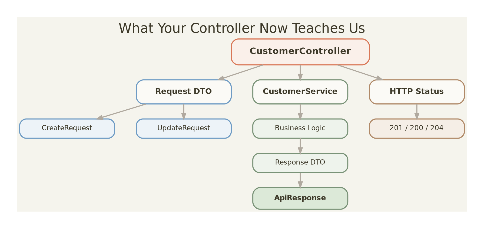

# Learning Note: DELETE API — 200 OK vs 204 No Content

**Project:** SKCP – Shree Kundodari Cement Products  
**Module:** Customer API  
**Topic:** REST API Response Status Codes  
**Date:** 2026-08-10  
**Status:** Completed  
**Related Layer:** Service → Controller → HTTP Response

---

## 1. What We Observed

While testing the Customer DELETE API in Postman, the API was successfully deleting the customer.

The request was:

```http
DELETE /api/customers/{id}
```

Example: 
> DELETE http://localhost:8080/api/customers/11

The API returned:

> 200 OK

with the following response body:

```text
{
  "data": null,
  "message": "Customer deleted successfully",
  "success": true,
  "timestamp": "2026-08-10T11:18:16.7190604"
}
```

At first, the API looked successful because:

* Customer was deleted.
* HTTP response was successful.
* Response message was returned.
* `success` was `true`.

However, we identified that this was not the REST response we wanted for a DELETE operation.

---

##  2. What Should DELETE Return?

For a successful DELETE operation where there is no response body to return, the preferred HTTP status is:

> 204 No Content

The important difference is:

> 200 OK

Means:

> The request was successfully processed and a response representation may be returned.

Example:
> 200 OK

```text
{
  "message": "Customer deleted successfully"
}
```
### 204 No Content

Means:

> The request was successfully processed, but there is no content to return.

Example:

> 204 No Content

There should be no response body.

---

## 3. Why Were We Getting 200 OK?

The reason was that our DELETE endpoint was returning a response body.

Conceptually, the controller was doing something similar to:

```text
return ResponseEntity.ok(
        ApiResponse.success(
                null,
                "Customer deleted successfully"
        )
);

```
Because we explicitly returned an HTTP 200 OK response containing JSON, Spring correctly returned:

> 200 OK

This was not a Spring error.

The application was behaving exactly according to the response we told the controller to produce.

---

### 4. The REST Design Decision

For SKCP, we decided that the DELETE endpoint should follow this contract:

```text
DELETE customer
       ↓
Customer exists?
       ↓
Yes
       ↓
Delete customer
       ↓
Return 204 No Content
       ↓
No response body
```
Therefore:

```text
DELETE /api/customers/{id}
```
should return:

```text
204 No Content
```

when the customer is successfully deleted.

---

### 5. The Change We Made
### Before
The controller returned 200 OK with a JSON response body.

Conceptually:

```text
return ResponseEntity.ok(
        ApiResponse.success(
                null,
                "Customer deleted successfully"
        )
);
```
This resulted in:
```text
200 OK
```

and:

```text
{
  "data": null,
  "message": "Customer deleted successfully",
  "success": true,
  "timestamp": "..."
}
```

---
### After
The DELETE controller should return:

```text
return ResponseEntity.noContent().build();
```
This produces:

> 204 No Content

with an empty response body.

---


## 7. Why We Do Not Return Our Standard ApiResponse for 204


SKCP has a standard API response structure such as:

```text
{
  "data": {},
  "message": "...",
  "success": true,
  "timestamp": "..."
}
```
This is useful for APIs that return content.

For example:
> GET /api/customers/17

can return:

```text
{
  "data": {
    "customerId": 17,
    "customerName": "Akash Kamat"
  },
  "message": "Customer retrieved successfully",
  "success": true,
  "timestamp": "..."
}
```
However, `204 No Content` specifically means:

> There is no response content.

Therefore, we should not return:

```text
{
  "data": null,
  "message": "Customer deleted successfully",
  "success": true
}
```
with a 204 response.
The response body should remain empty.

---
## 8. Correct DELETE Contract for SKCP

#### Request

DELETE /api/customers/17

Successful response

> 204 No Content

#### Response body

> EMPTY

There should be no JSON body.

---
## 9. What Happens in the Service Layer?

The service layer is still responsible for the business operation:

> customerService.deleteCustomer(id);

The service performs the deletion.

The controller is responsible for translating that successful operation into the appropriate HTTP response.

Therefore:
```text
CustomerController
        |
        | deleteCustomer(id)
        ↓
CustomerService
        |
        | delete from database
        ↓
PostgreSQL
        |
        | deletion successful
        ↓
CustomerService
        |
        ↓
CustomerController
        |
        ↓
204 No Content
```
This gives us a useful separation of responsibility:
- Service: performs the business operation.
- Controller: decides the HTTP response.
- HTTP status code: communicates the result to the client.

---

## 10. How We Learned to Diagnose This
When an API returns an unexpected HTTP status code, do not immediately assume that the service is wrong.

First check:

1. What does the service return?
2. What does the controller return?
3. Is the controller returning a response body?
4. Which ResponseEntity method is being used?
5. What HTTP status does that method produce?

For example:

> ResponseEntity.ok(...)

means:

> 200 OK

while:

 > ResponseEntity.noContent().build()

 means:
 > 204 No Content

 ---

## 11. Testing in Postman

After making the change, send:

> DELETE http://localhost:8080/api/customers/{existingId}

Expected result:

>204 No Content

The response body should be empty.

---

## 12. What We Should NOT Change

The following Customer APIs are already working correctly and should not be changed 
because of this issue:

```text
GET /api/customers
GET /api/customers/{id}
POST /api/customers
PUT /api/customers/{id}
```

Their response semantics are different.

The change is specifically for:

> DELETE /api/customers/{id}

---

## 13. Key Learning

### HTTP status codes are part of the API contract.

Returning the correct data is not enough.

The API must also communicate the correct result through the HTTP status code.

For SKCP:

```text
GET existing customer
        → 200 OK

GET non-existing customer
        → 404 Not Found

POST customer
        → 201 Created

PUT customer
        → 200 OK

DELETE customer
        → 204 No Content
```
---
## 14. Interview Learning

#### Question

Why would a DELETE API return 200 OK instead of 204 No Content?

#### Answer

Because the controller is returning a successful response with a response body, usually through something such as:

> ResponseEntity.ok(...)

If the DELETE operation succeeds and there is no content to return, the controller can instead return:

> ResponseEntity.noContent().build();

which produces:
> 204 No Content

with an empty response body.

---


## 15. SKCP Architecture Lesson

This small change reinforced an important architectural principle:

> The service layer performs the business operation, while the controller translates the result into an HTTP API contract.

In SKCP:

```text

HTTP Request
     ↓
CustomerController
     ↓
CustomerService
     ↓
CustomerRepository
     ↓
PostgreSQL
     ↓
CustomerService
     ↓
CustomerController
     ↓
HTTP Response
```
The controller therefore should not simply expose whatever the service returns.

It should intentionally choose the appropriate HTTP response semantics.

---

## 16. Final Status

Customer DELETE API:

```text
Before:
DELETE → 200 OK + JSON body

After:
DELETE → 204 No Content + empty body
```
This completes the REST response correction for the Customer DELETE endpoint.

---

### The key thing to remember

This is **not just a "fix 200 to 204" note**. 

The learning is:

> **Service performs the operation → Controller decides the HTTP contract.**

----
